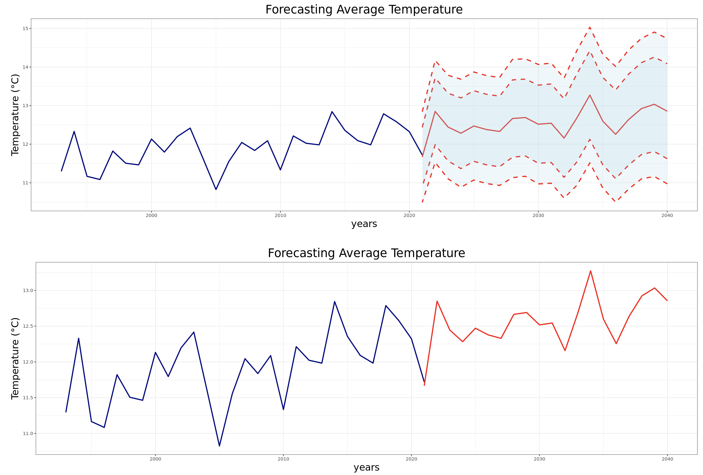
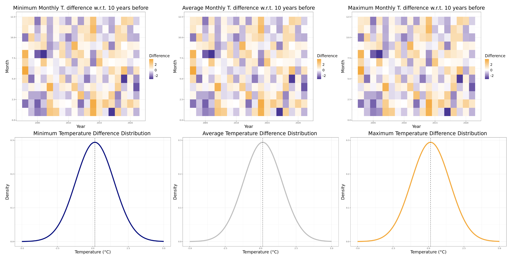
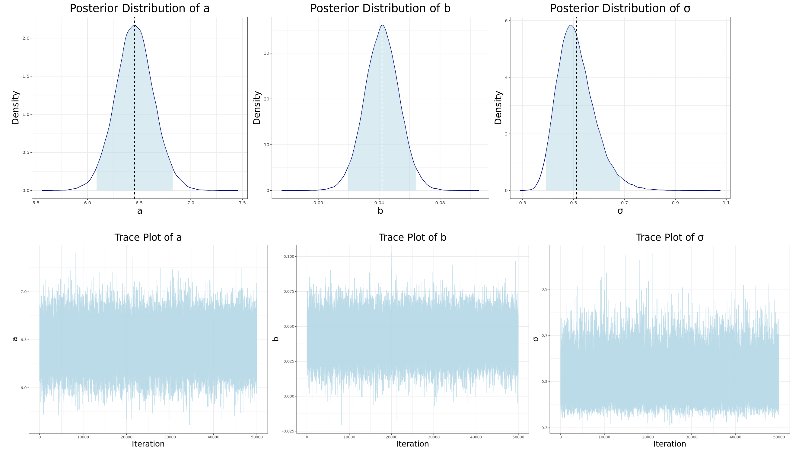
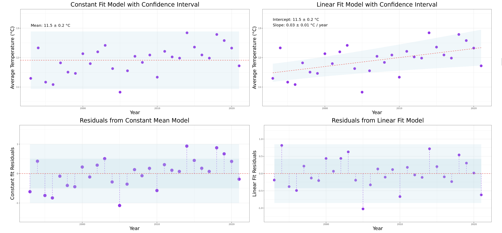

# Advanced Statistics for Physics Analysis

**Authors**: Lorenzo Cavezza, Giacomo Longaroni  
**Project**: Advanced Statistics for Physics Analysis  
**Tools**: R, JAGS, forecast, ARPAV dataset  

 

## Overview

This project applies Bayesian statistical analysis on ARPAV weather data using R. It explores models for predicting weather patterns, combining Bayesian modeling (via JAGS) and time series forecasting (using the `forecast` package). The models include constant and linear regression with MCMC, alongside ARIMA-based time forecasting.

## Repository Content

- **`Cavezza_Longaroni.ipynb`**: Jupyter notebook containing data loading, preprocessing, statistical modeling, and forecasting.
- **`const_model.jags`**: JAGS script for constant regression in Bayesian analysis.
- **`lin_model.jags`**: JAGS script for linear regression in Bayesian analysis.
- **`datiarpav`**: Folder containing the ARPAV dataset used.
- **`Plots`**: Directory for generated plots and visualizations.

## Key Components

1. **Bayesian Analysis**: Utilizes JAGS for MCMC simulation and for regression models on weather data.

 

2. **Time Series Forecasting**: Uses the `forecast` package in R for ARIMA-based weather forecasting.

4. **Model Evaluation**: Assessed using posterior distributions, hypotesis test and quality metrics over the regressions.

